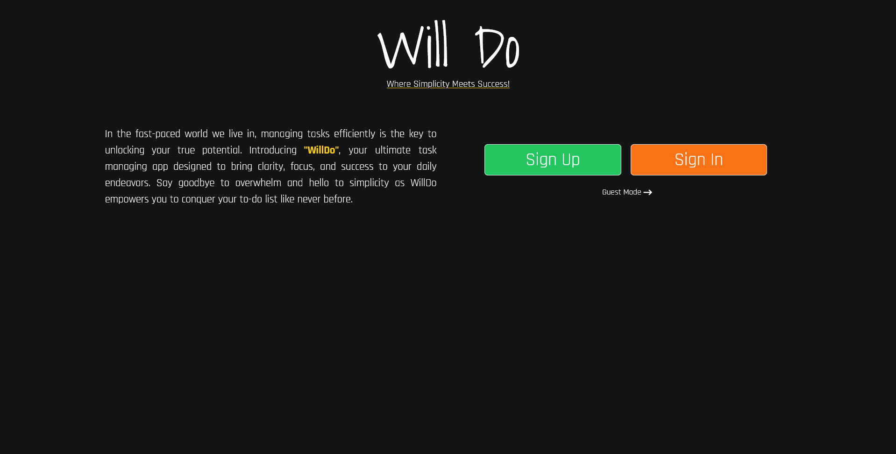
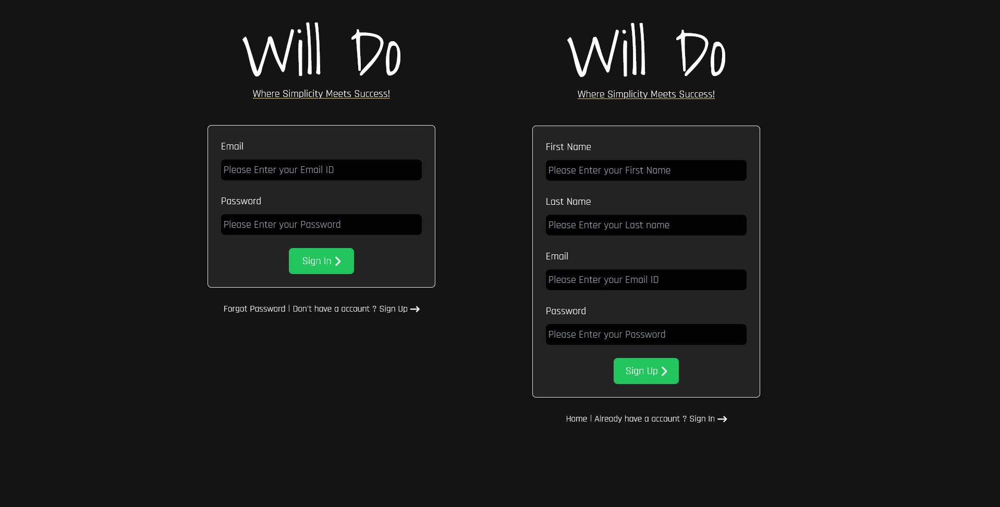
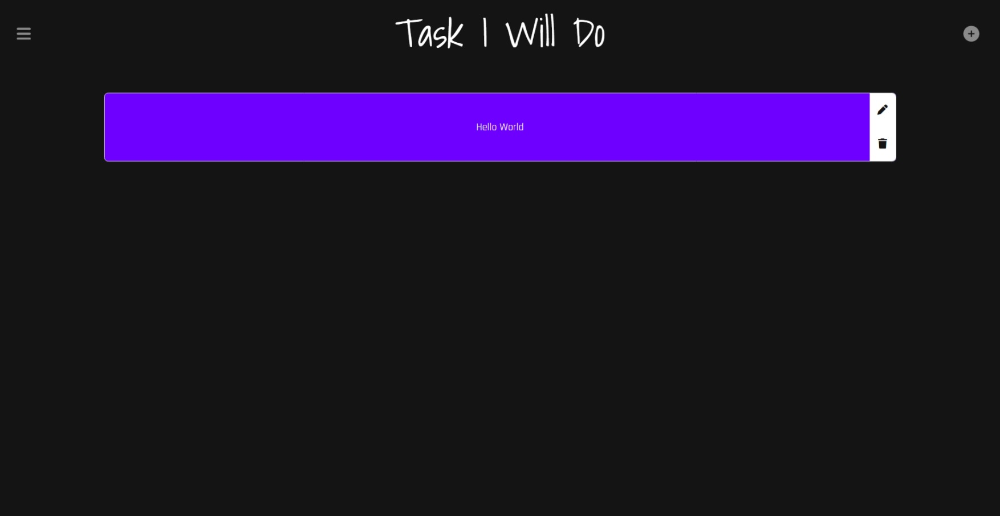

  

<h1 align="center" style="font-size: 36px;">WillDo</h1>

Welcome to WillDo, a stylish and functional ToDo application built with React and Python Flask!

## Features

- **Custom Token-Based Authentication**: Securely authenticate users using custom tokens for enhanced security.
- **CSRF Protection**: Utilize Cross-Site Request Forgery protection to ensure data integrity.
- **User Management**:
  - New User Creation: Allow users to register and create accounts.
  - Password Reset with OTP: Reset passwords with One-Time Password (OTP) sent to verify user identity.
- **Guest Mode**: Enable users to use the app without creating an account.

## Technologies Used

- Frontend: React with Vite
- Backend: Python Flask
- Database: MongoDB

## Screenshots

Here are some screenshots showcasing the user interface of WillDo:

## Getting Started

Follow these steps to set up and run the WillDo ToDo App on your local machine:

1. Clone this repository.
2. Set up the backend:
   - Navigate to the `Server/api` directory.
   - Install Python dependencies: `pip install -r requirements.txt`.
   - Configure the necessary environment variables:
     - `MONGOURL`: MongoDB connection URL.
     - `JWT_SECRET_KEY`: Secret key for JWT token encryption.
     - `CLIENT_ID`, `CLIENT_SECRET`, `REFRESH_TOKEN`: Google API credentials for sending OTP verification emails.
   - Run the Flask app: `python Server.py`.
3. Set up the frontend:
   - Navigate to the `Client` directory.
   - Install Node.js dependencies: `npm install`.
   - Start the Vite development server: `npm run dev -- --port 5173`.
4. Access the app in your browser at `http://localhost:5173`.

## Code Quality

The codebase for WillDo ToDo App is meticulously commented to ensure better understanding and maintainability. We believe that well-commented code is crucial for collaboration and future enhancements.

## Contributing

Contributions are welcome! If you'd like to contribute to WillDo ToDo App, please follow these steps:

1. Fork the repository.
2. Create a new branch for your feature: `git checkout -b feature-name`.
3. Make your changes and test thoroughly.
4. Commit your changes: `git commit -m "Add your message here"`.
5. Push to the branch: `git push origin feature-name`.
6. Create a pull request describing your changes.

## License

This project is licensed under the [MIT License](/LICENSE).

---

Enjoy using WillDo ToDo App! If you encounter any issues or have suggestions for improvements, please feel free to [open an issue](https://github.com/26th-Official/WillDo/issues).
